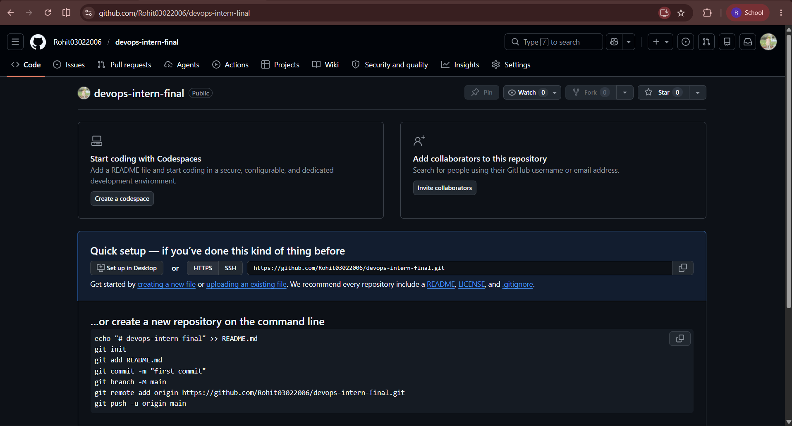
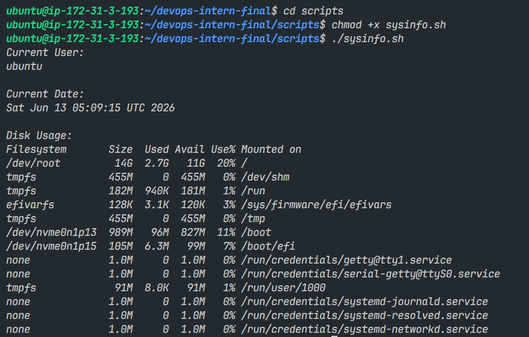
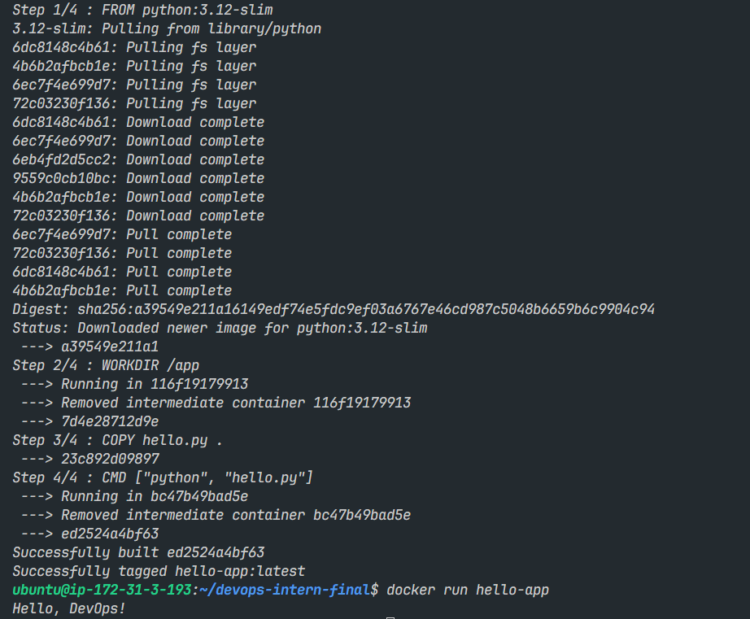
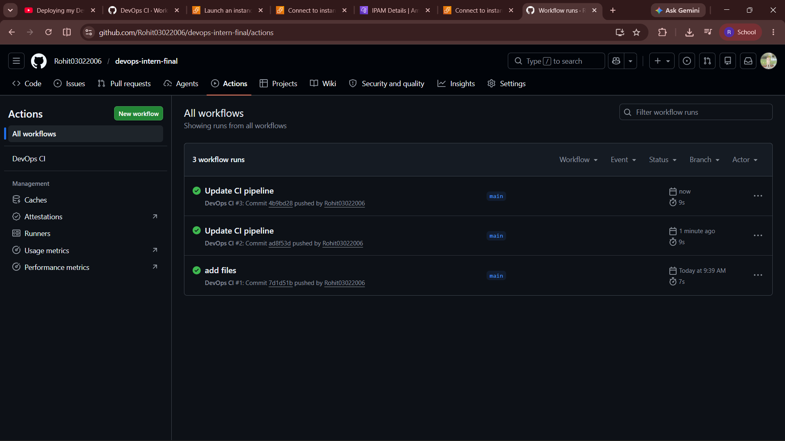
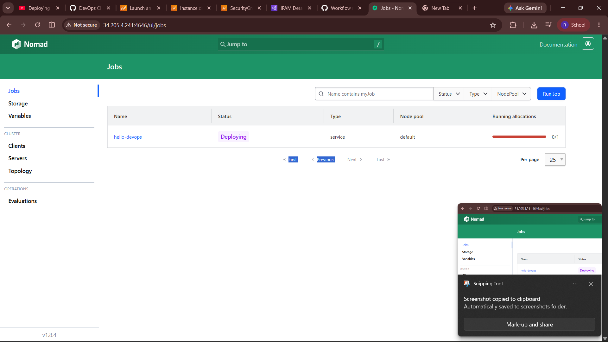

# DevOps Intern Final Assessment

**Name:** Rohit  
**Date:** June 2026

## Project Overview

This project demonstrates fundamental DevOps concepts including Git & GitHub, Linux scripting, Docker containerization, GitHub Actions CI/CD, Nomad job deployment, and Grafana Loki monitoring.

---

## Step 1: Git & GitHub Setup

Created a public GitHub repository and initialized the project structure. Added the application file and project documentation.

### Screenshot



---

## Step 2: Linux Scripting

Created a shell script that displays:

* Current User
* Current Date
* Disk Usage Information

The script was tested successfully on Linux.

### Screenshot



---

## Step 3: Docker Containerization

Containerized the application using Docker.

Tasks completed:

* Created Docker image
* Built image successfully
* Ran container successfully
* Verified application output

### Screenshot



---

## Step 4: GitHub Actions CI/CD

Configured GitHub Actions workflow to automatically execute the application whenever code is pushed to the repository.

Verified:

* Workflow execution
* Successful build status
* Automated pipeline execution

### Screenshot



---

## Step 5: Nomad Deployment

Created a Nomad job specification for deploying the Docker container.

Verified:

* Job definition created
* Resource limits configured
* Deployment instructions documented

### Screenshot



---

## Step 6: Grafana Loki Monitoring

Configured Grafana Loki for log aggregation and monitoring.

Documented:

* Loki startup procedure
* Log viewing commands
* Monitoring workflow

### Screenshot


---

## Installation Requirements

The following tools are required:

* Git
* Python 3
* Docker
* GitHub Account
* Nomad
* Grafana Loki

---

## How to Run

1. Clone the repository.
2. Run the application.
3. Execute the Linux script.
4. Build and run the Docker container.
5. Trigger the GitHub Actions workflow through a commit.
6. Deploy using Nomad.
7. Monitor logs using Grafana Loki.

---

---

## Verification Commands

### Run Application

```bash
python3 hello.py
```

### Execute Linux Script

```bash
chmod +x scripts/sysinfo.sh
./scripts/sysinfo.sh
```

### Build Docker Image

```bash
docker build -t hello-app .
```

### Run Docker Container

```bash
docker run hello-app
```

### Check Nomad Job Status

```bash
nomad status
```

### Verify Loki

```bash
curl localhost:3100/ready
```

Expected Output:

```text
ready
```
---
## Conclusion

This project successfully demonstrates a complete beginner DevOps workflow covering source control, Linux administration, containerization, CI/CD automation, workload deployment, and monitoring.

